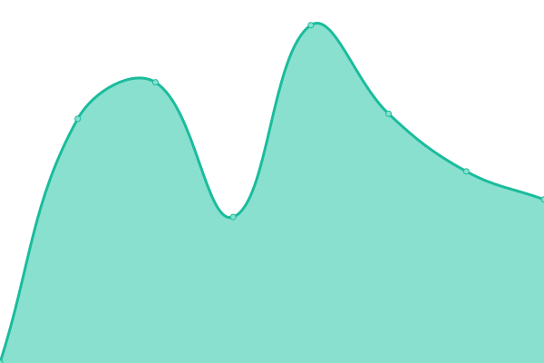
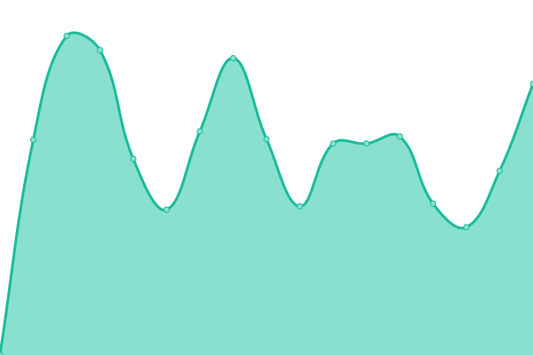

# [📈 Live Status](https://orange-curlew-531689.hostingersite.com): <!--live status--> **🟩 All systems operational**

This repository contains the open-source uptime monitor and status page for [test-new](https://orange-curlew-531689.hostingersite.com), powered by [Upptime](https://github.com/upptime/upptime).

With [Upptime](https://upptime.js.org), you can get your own unlimited and free uptime monitor and status page, powered entirely by a GitHub repository. We use [Issues](https://github.com/test-new/test-new/issues) as incident reports, [Actions](https://github.com/test-new/test-new/actions) as uptime monitors, and [Pages](https://orange-curlew-531689.hostingersite.com) for the status page.

<!--start: status pages-->
<!-- This summary is generated by Upptime (https://github.com/upptime/upptime) -->
<!-- Do not edit this manually, your changes will be overwritten -->
<!-- prettier-ignore -->
| URL | Status | History | Response Time | Uptime |
| --- | ------ | ------- | ------------- | ------ |
|  [Igarden.ai - test](https://www.igarden.ai) | 🟩 Up | [igarden-ai-test.yml](https://github.com/Edenyip/upptime-site-new/commits/HEAD/history/igarden-ai-test.yml) | 

 646ms
     
 | 

<a href="https://Edenyip.github.io/upptime-site-new/history/igarden-ai-test">100.00%</a>
    

|  [Fairlandgroup - test](https://www.fairlandgroup.com) | 🟩 Up | [fairlandgroup-test.yml](https://github.com/Edenyip/upptime-site-new/commits/HEAD/history/fairlandgroup-test.yml) | 

 868ms
     
 | 

<a href="https://Edenyip.github.io/upptime-site-new/history/fairlandgroup-test">100.00%</a>
    

|  [Fairland - test](https://www.fairland.com.cn) | 🟩 Up | [fairland-test.yml](https://github.com/Edenyip/upptime-site-new/commits/HEAD/history/fairland-test.yml) | 

 714ms
     
 | 

<a href="https://Edenyip.github.io/upptime-site-new/history/fairland-test">100.00%</a>
    

|  [Aquark - test](https://www.aquark.com) | 🟩 Up | [aquark-test.yml](https://github.com/Edenyip/upptime-site-new/commits/HEAD/history/aquark-test.yml) | 

 1040ms
     
 | 

<a href="https://Edenyip.github.io/upptime-site-new/history/aquark-test">100.00%</a>
    

|  [Aquagem - test](https://www.aquagem.com) | 🟩 Up | [aquagem-test.yml](https://github.com/Edenyip/upptime-site-new/commits/HEAD/history/aquagem-test.yml) | 

 994ms
     
 | 

<a href="https://Edenyip.github.io/upptime-site-new/history/aquagem-test">100.00%</a>
    

<!--end: status pages-->

[**Visit our status website →**](https://orange-curlew-531689.hostingersite.com)

## 📄 License

- Powered by: [Upptime](https://github.com/upptime/upptime)
- Code: [MIT](./LICENSE) © [Anand Chowdhary](https://anandchowdhary.com), supported by [Pabio](https://pabio.com)
- Data in the `./history` directory: [Open Database License](https://opendatacommons.org/licenses/odbl/1-0/)
